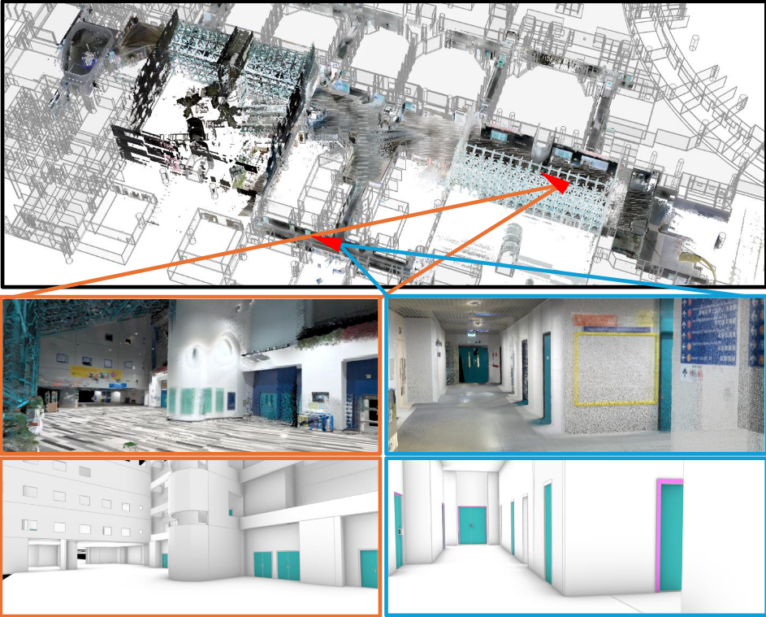
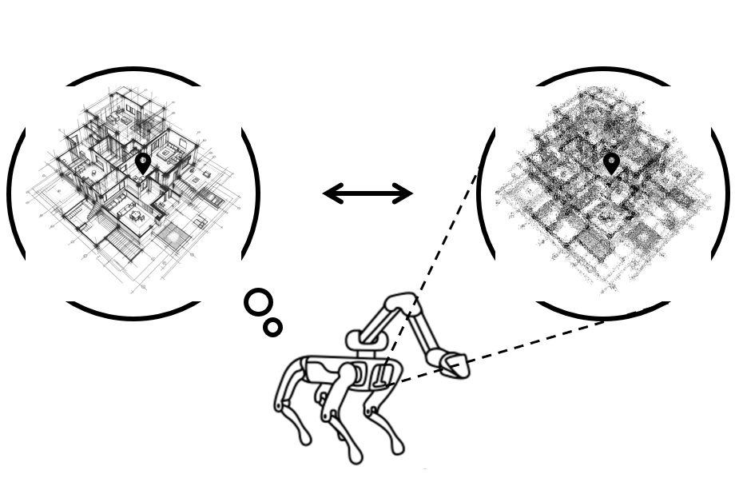
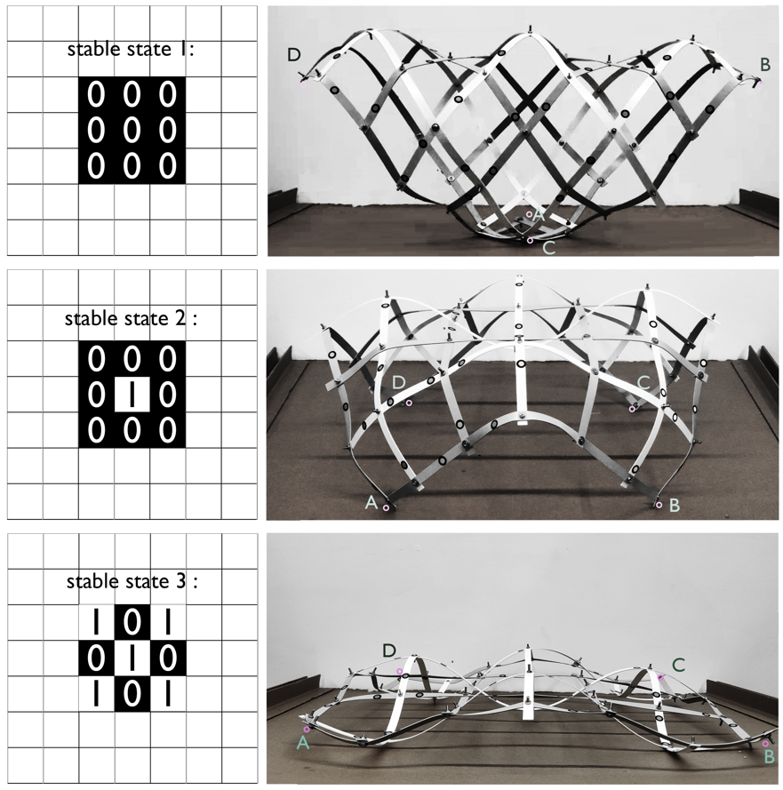
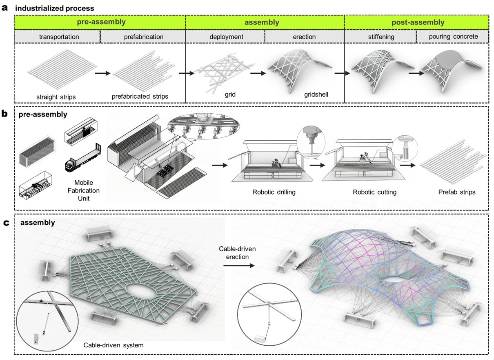
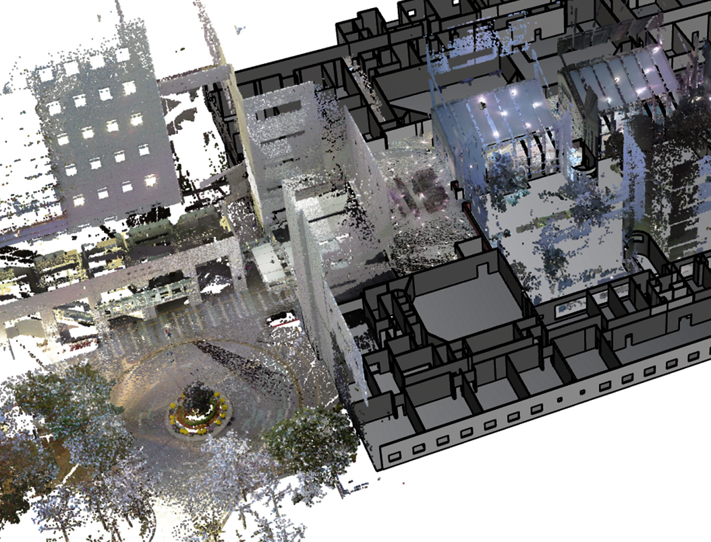

<h1>Publications</h1>
<html>
    <table style="width:100%;border:0px;border-spacing:0px;border-collapse:separate;margin-right:auto;margin-left:auto;">
          <tr onmouseout="nightsight_stop()" onmouseover="nightsight_start()">
            <td style="padding:20px;width:25%;vertical-align:middle;border-left-style:none;border-bottom-style:none;border-top-style:none;border-right-style:none">
              
            </td>
            <td style="padding:20px;width:75%;vertical-align:middle;border-left-style:none;border-bottom-style:none;border-top-style:none;border-right-style:none">
                <papertitle>SLABIM: A SLAM-BIM Coupled Dataset in HKUST Main Building \\in Urban Environments
                </papertitle>
               
                <strong>Haoming Huang</strong>, Zhijian Qiao, Zehuan Yu, Chuhao Liu, Shaojie Shen, and Huan Yin
               
              <em>2025 IEEE International Conference on Robotics & Automation.</em> 
              <a href="https://github.com/HKUST-Aerial-Robotics/SLABIM">dataset</a> /
              <a href="https://www.youtube.com/watch?v=7NckgY15ABQ">video</a> /
              <a href="https://github.com/HKUST-Aerial-Robotics/SLABIM">code</a>
            </td>
          </tr>
    </table>
    <table style="width:100%;border:0px;border-spacing:0px;border-collapse:separate;margin-right:auto;margin-left:auto;">
          <tr onmouseout="nightsight_stop()" onmouseover="nightsight_start()">
            <td style="padding:20px;width:25%;vertical-align:middle;border-left-style:none;border-bottom-style:none;border-top-style:none;border-right-style:none">
              
            </td>
            <td style="padding:20px;width:75%;vertical-align:middle;border-left-style:none;border-bottom-style:none;border-top-style:none;border-right-style:none">
                <papertitle>Speak the Same Language: Global LiDAR Registration on BIM Using Pose Hough Transform
                </papertitle>
               
                Zhijian Qiao†, <strong>Haoming Huang†</strong>, Chuhao Liu, Shaojie Shen, Fumin Zhang, Huan Yin
               
              <em>IEEE Transactions on Automation Science and Engineering, March 2025.</em> 
              <a href="https://arxiv.org/abs/2405.03969">arxiv</a> / 
              <a href="https://github.com/HKUST-Aerial-Robotics/LiDAR2BIM-Registration">code</a> / 
              <a href="https://www.youtube.com/watch?v=SWbnsaRyL-M&feature=youtu.be">video</a>
            </td>
          </tr>
    </table>
    <table style="width:100%;border:0px;border-spacing:0px;border-collapse:separate;margin-right:auto;margin-left:auto;">
          <tr onmouseout="nightsight_stop()" onmouseover="nightsight_start()">
            <td style="padding:20px;width:25%;vertical-align:middle;border-left-style:none;border-bottom-style:none;border-top-style:none;border-right-style:none">
              
            </td>
            <td style="padding:20px;width:75%;vertical-align:middle;border-left-style:none;border-bottom-style:none;border-top-style:none;border-right-style:none">
                <papertitle>Multistable grid shell as a flexible and reusable
formwork for the sustainable construction of snow and iced structures
                </papertitle>
               
               <strong>Haoming Huang</strong>, Jian Wen, Zhixiong Huang, Xiaofan Gao, Yangsheng Lin, Lu Xiong, and Nan Hu
               
              <em>Proceedings of IASS Annual Symposia (Vol.
2022, No. 17, pp. 1-8). International Association for Shell and Spatial Structures (IASS).</em> 
            </td>
          </tr>
    </table>
    <table style="width:100%;border:0px;border-spacing:0px;border-collapse:separate;margin-right:auto;margin-left:auto;">
          <tr onmouseout="nightsight_stop()" onmouseover="nightsight_start()">
            <td style="padding:20px;width:25%;vertical-align:middle;border-left-style:none;border-bottom-style:none;border-top-style:none;border-right-style:none">
              
            </td>
            <td style="padding:20px;width:75%;vertical-align:middle;border-left-style:none;border-bottom-style:none;border-top-style:none;border-right-style:none">
                <papertitle>Cable-driven assembly of elastic grid formworks toward sustainable
shell constructions
                </papertitle>
               
                Xiaofan Gao†, <strong>Haoming Huang†</strong>, Jianming Chen, and Lu Xiong, 
               
              <em>Proceedings of IASS Annual Symposia (Vol. 2022, No. 17, pp. 1-8). International Association for
Shell and Spatial Structures (IASS)</em> 
            </td>
          </tr>
    </table>

</html>
<h1>Posters, and Workshop Summaries</h1>
<html>
    <table style="width:100%;border:0px;border-spacing:0px;border-collapse:separate;margin-right:auto;margin-left:auto;">
          <tr onmouseout="nightsight_stop()" onmouseover="nightsight_start()">
            <td style="padding:20px;width:25%;vertical-align:middle;border-left-style:none;border-bottom-style:none;border-top-style:none;border-right-style:none">
              
            </td>
            <td style="padding:20px;width:75%;vertical-align:middle;border-left-style:none;border-bottom-style:none;border-top-style:none;border-right-style:none">
                <papertitle>lobal LiDAR registration on
BIM leveraging pose hough transform
                </papertitle>
               
                <strong>Haoming Huang†</strong>, Zhijian Qiao†, Chuhao Liu, Shaojie Shen, Fumin Zhang, Huan Yin
               
              <em>3rd Workshop on Future of Construction: Lifelong Learning Robots in
Changing Construction Sites (2024), ICRA, Yokohama, Japan, 2024</em> 
              <a href="../files/icra_poster.pdf">poster</a>
            </td>
          </tr>
    </table>
</html>